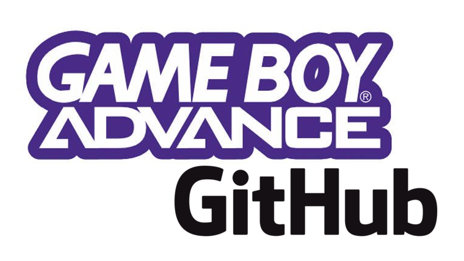

# Fire Emblem - GBA-RPG-via-GitHub-contre-Covid-2020

[Sur ce dépôt git](https://github.com/GBA-RPG-via-GitHub-contre-Covid-2020/Fire-Emblem), nous allons stocker les sauvegardes et captures d'écran de notre première partie de Pokémon Jaune, suivant les idées présentées dans [ce projet "GBA-RPG-via-GitHub-contre-Covid-2020"](https://github.com/GBA-RPG-via-GitHub-contre-Covid-2020/).

> Auteur : [Lilian Besson (@Naereen)](https://github.com/Naereen/), inspiré librement par [Twitch plays Pokémon](https://fr.wikipedia.org/wiki/Twitch_Plays_Pok%C3%A9mon).
> Regardez [le premier projet sur Pokémon](https://pokemon-via-github-contre-covid-2020-fr.github.io/).

---

## Discord

Venez discuter sur [ce serveur Discord](https://discord.gg/e74Fy7) ! Dans le canal **"Fire Emblem"**.

## Foire aux questions

### Comment jouer ?

Il faut suivre les instructions suivantes :

1. Créer un compte GitHub, ajouter [une étoile au projet](https://github.com/GBA-RPG-via-GitHub-contre-Covid-2020/Fire-Emblem/stargazers) (ou au [méta projet](https://github.com/GBA-RPG-via-GitHub-contre-Covid-2020/GBA-RPG-via-GitHub-contre-Covid-2020.github.io)). Je vous invite à devenir membre de l'organisation, puis [il vous faut éditer ce fichier](https://github.com/GBA-RPG-via-GitHub-contre-Covid-2020/GBA-RPG-via-GitHub-contre-Covid-2020.github.io/blob/master/whois.md) sans faire de fusio-demande (= *pull request*).

2. Télécharger un émulateur, **je recommande mGBA** ou Visual Boy Advance, **sur un ordinateur** et pas un téléphone,

3. Télécharger la ROM, vérifier que c'est la bonne en vérifiant [sa somme `md5sum`](Fire_Emblem_Europe.gba.md5sum), [son nombre de bits](Fire_Emblem_Europe.gba.md5sum) (et les informations renvoyées par [`file Fire_Emblem_Europe.gba`](Fire_Emblem_Europe.gba.md5sum) dans un terminal sous GNU/Linux). Regarder [ce ticket](https://github.com/GBA-RPG-via-GitHub-contre-Covid-2020/Fire-Emblem/issues/1) si vous avez du mal à télécharger la ROM.

4. [Cloner le dépôt](https://github.com/GBA-RPG-via-GitHub-contre-Covid-2020/Version-Jaune), et vérifier que vous pouvez lancer le jeu, et charger la sauvegarde. Vérifier que vous pouvez sauvegarder, puis ensuite prenez l'habitude de lancer une session de jeu avec `make play`, qui automatise l'algorithme de gestion de conflit de jeux (cf. explications ci-dessous).

### Avec le `Makefile`

Une fois le dépôt cloné, si vous êtes sous GNU/Linux ou Mac OS, le [fichier `Makefile`](https://github.com/GBA-RPG-via-GitHub-contre-Covid-2020/Fire-Emblem/blob/master/Makefile) donne quelques commandes pour automatiser certaines choses 

- `make metadata` permet de vérifier que la ROM `Fire_Emblem_Europe.gba` téléchargée est la bonne ;
- `make start_playing` permet de commencer à jouer avec mGBA,
- `make play` automatise l'algorithme de gestion de jeu :
   1. vérifier que personne n'est en train de jouer (avec `make check_free_slot`),
   2. écrire et envoyer un commit disant que le joueur actuel est en train de jouer (ie, un commit dont le message commence par `"START user ..."`) (avec `make commit_start`),
   3. lance mGBA sur la sauvegarde actuelle (avec `make start_playing`),
   4. quand mGBA se ferme, ajoute dans un commit git la nouvelle sauvegarde, et les captures d'écran, et envoie un commit de fin de session (ie, un commit dont le message commence par `"DONE user ..."`_) (avec `make commit_done`).

---

## Questions à propos du jeu

### Qui est en train de jouer ?

> Il faut regarder [l'auteur du dernier commit](https://github.com/GBA-RPG-via-GitHub-contre-Covid-2020/Fire-Emblem/commits/master), qui a commencé sa session de jeu avec un commit dont le message commence par `"START ..."`.

**Personne** ne joue actuellement.

> La ligne précédente est normalement [mise à jour automatiquement](update_readme_start.sh).

### Qui joue ensuite ?

- Il n'y a pas et *il n'y aura pas* de mécanisme de file d'attente : dès que le joueur courant arrête, c'est-à-dire qu'elle a terminé sa session de jeu (avec un commit dont le message commence par `"END ..."`), n'importe qui peut venir jouer et prendre le relai !

- Essayez de gérer cela intelligemment, et ne soyez pas trop pressé : si vous vous abonnez [au flux RSS](https://github.com/GBA-RPG-via-GitHub-contre-Covid-2020/Fire-Emblem/commits/master.atom) du projet, vous pouvez recevoir des notifications ou des mails quand un joueur commence et termine sa session.

  > Moi je vais le faire, au moins au début, pour vérifier que le projet ne part pas en cacahuètes.

- Donc je me répète : pas de mécanisme de file d'attente, et on reste calme et pas trop réactif pour éviter les bogues !

### Qui a joué quand ?

> Il faut regarder [l'historique des commits](https://github.com/GBA-RPG-via-GitHub-contre-Covid-2020/Fire-Emblem/commits/master). Vous pouvez aussi consulter [ce fichier `whoPlayedWhen.log`](whoPlayedWhen.log).

Dernière ligne de l'historique :

TODO

> La ligne précédente est normalement [mise à jour automatiquement](update_readme_done.sh).

### Dernière question ?

- [Posez une question](https://github.com/GBA-RPG-via-GitHub-contre-Covid-2020/Fire-Emblem/issues/new) en ouvrant un ticket.

---

## Où en est-on dans l'aventure ?

- Au tout début !

### Où est-on dans le jeu ?

- [Regardez dans ce dossier](screenshots/)
- TODO tout le monde doit prendre l'habitude de finir sa session de jeu en faisant une capture d'écran dans ce dossier !
  > Il faut juste montrer où on se trouve l'aventure.

---

## :scroll: License ? 

MIT Licensed (file [LICENSE](LICENSE)).
© [Lilian Besson](https://GitHub.com/Naereen), 2020.

